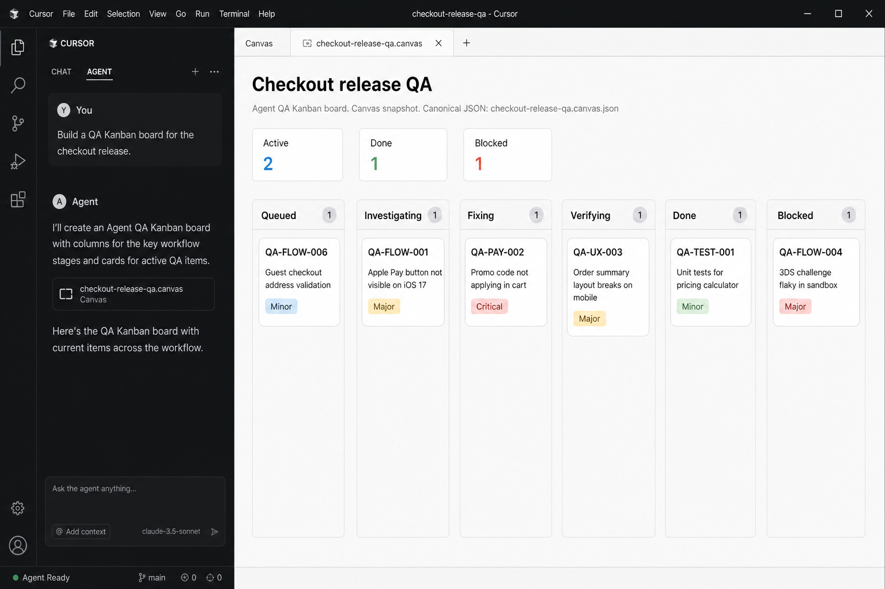
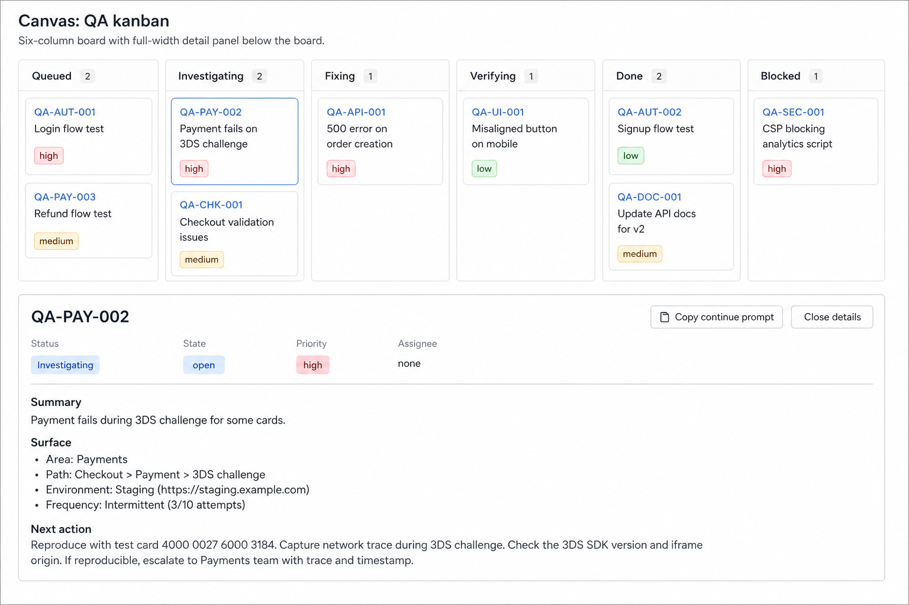

# Agent QA Kanban

Agent QA Kanban is an open Agent Skill that combines three default workflows
and one explicitly requested execution profile:

1. evidence-led regression and exploratory QA
2. a live kanban view of every QA card
3. append-only learning from explicit human QA feedback
4. opt-in visual/browser interaction QA with honest host capability blocking

The board JSON is the source of truth. Host-specific renderers turn the same
board into a Codex inline visualization, a Cursor Canvas beside chat, an
optional Claude inline widget when the host exposes `visualize` `show_widget`,
a standalone/Claude HTML artifact, or a Markdown fallback.

## Preview

### Compact six-column board (HTML / Codex)


The overview keeps all six statuses in one horizontal row. Each column scrolls
vertically while the board wrapper owns horizontal scrolling.

### Card detail dialog (HTML / Codex)


Selecting a compact card opens its full evidence, diagnosis, and next action in
a read-only dialog instead of extending the board page.

_Both HTML previews are rendered from `examples/qa-board.example.json` at the
same viewport and contain synthetic data only._

### Cursor Canvas beside chat

When this skill is installed for Cursor and the agent runs in Cursor with
Canvas available, the board opens as a **Canvas** beside the chat (side/right
panel). This is not a Codex thread HTML fragment.

#### Board overview



#### Card detail



Card selection opens a full-width detail panel below the board. Compact cards
show `severity` and `classification`; the detail panel shows `resolution`,
`severity`, and `change_scope`, plus summary / surface / next action and
**Copy continue prompt**. Columns scroll vertically only; the board scrolls
horizontally only. There is no drag-and-drop and no status-changing control —
canonical updates stay in `qa-board.json`.

_Both Cursor previews contain synthetic QA data._

To generate the current Cursor surface, use
`examples/qa-board.example.json` with `scripts/hosts/cursor-canvas.mjs` and
open the resulting `.canvas.tsx` in Cursor.

## Why this exists

QA execution skills, kanban task managers, and interactive artifact builders
usually exist as separate tools. This skill joins them without making the UI
the system of record:

- every finding has a stable card ID, status, classification, evidence, and
  next action
- cards move through `queued`, `investigating`, `fixing`, `verifying`, `done`,
  or `blocked`
- a card cannot be marked done without verification evidence
- human feedback is learned separately from agent-discovered findings
- human learning is appended only when repository policy or the user authorizes it
- unsupported hosts still receive a complete Markdown board
- visual/browser execution is never automatic: it requires an explicit user
  request and remains independent from mode and lane

## Install

This repository is both the direct Agent Skills source and the plugin root.
Codex, Claude Code, and Grok all resolve the same canonical
`skills/agent-qa-kanban` directory; there is no host-specific copy to drift.

Installing the skill or plugin only registers discoverable instructions. It
does not create a project, `.qa-kanban/`, or `qa-board.json`, and it does not
start QA. Execution begins only when `$agent-qa-kanban` is explicitly invoked
or the host's normal skill trigger matches a user QA request. The optional
visual/browser profile still requires a separate explicit user request.

### General

Install for Agent Skills-compatible hosts:

```bash
npx skills add jadeonstudio/agent-qa-kanban --skill agent-qa-kanban
```

Or copy `skills/agent-qa-kanban` into the skill directory used by your agent.

### Codex plugin

Add this repository as a marketplace, then install the available plugin:

```bash
codex plugin marketplace add jadeonstudio/agent-qa-kanban
codex plugin add agent-qa-kanban@agent-qa-kanban
```

For a local checkout, replace the GitHub repository with its absolute path.

### Claude Code plugin

```bash
claude plugin marketplace add jadeonstudio/agent-qa-kanban
claude plugin install agent-qa-kanban@agent-qa-kanban
```

### Grok

Grok uses the same root `.claude-plugin/plugin.json`, Claude marketplace, and
canonical `skills/` tree. No second Grok-only skill copy is required. Validate
the layout with `grok plugin validate .` when the Grok CLI is installed.

### Cursor

Install explicitly for Cursor so the skill is discoverable under Cursor skill
paths (`.cursor/skills`, `.agents/skills`, and the matching user homes):

```bash
npx skills add jadeonstudio/agent-qa-kanban --skill agent-qa-kanban -g -a cursor -y
```

Cursor Canvas appears only when **all** are true:

1. the skill is installed on a Cursor/.agents skill path
2. the built-in Canvas host skill is available
3. the current agent process is a Cursor runtime session
   (`CURSOR_AGENT` / `CURSOR_CONVERSATION_ID`)

If any check fails, the skill falls back to Markdown (printed to stdout by the
Cursor renderer when `--markdown-out` is omitted) and must not claim a Canvas
board. See `skills/agent-qa-kanban/references/cursor-host.md`.

## Use

Example requests:

```text
Use $agent-qa-kanban to QA the checkout flow and keep the findings in an inline kanban.
```

```text
Use $agent-qa-kanban in audit-only dual-lane mode. Read our human QA log first,
then expand into adjacent routes and APIs.
```

Explicit visual/browser profile (not enabled by the requests above):

```text
Use $agent-qa-kanban to QA the checkout flow in audit-only dual-lane
visual-browser mode. If this runtime has no verified browser interaction
capability, do not pretend to execute it; leave the visual cards Blocked and
record the required capability.
```

```text
Continue QA-004, fix it, rerun the same scenario, and move the card only when
the evidence proves it.
```

On Cursor after install:

```text
Use $agent-qa-kanban, validate the board, and render the Cursor Canvas kanban.
```

## Board utilities

The utilities are dependency-free Node.js scripts.

```bash
node skills/agent-qa-kanban/scripts/validate-board.mjs \
  examples/qa-board.example.json

node skills/agent-qa-kanban/scripts/validate-board.mjs \
  examples/qa-board.visual.example.json

node skills/agent-qa-kanban/scripts/render-board.mjs \
  examples/qa-board.example.json \
  .tmp/qa-board-fragment.html \
  --mode fragment

node skills/agent-qa-kanban/scripts/render-board.mjs \
  examples/qa-board.example.json \
  .tmp/qa-board.html \
  --mode standalone

node skills/agent-qa-kanban/scripts/render-board.mjs \
  examples/qa-board.example.json \
  .tmp/qa-board-inline.html \
  --mode claude-inline

node skills/agent-qa-kanban/scripts/render-markdown.mjs \
  examples/qa-board.example.json \
  .tmp/qa-board.md

node skills/agent-qa-kanban/scripts/hosts/cursor-capabilities.mjs

node skills/agent-qa-kanban/scripts/hosts/cursor-canvas.mjs \
  examples/qa-board.example.json \
  --out .tmp/qa-kanban-example.canvas.tsx \
  --report .tmp/cursor-render-report.json
```

For a validated run board whose explicit profile is active, initialize the
run-local derived visual tree and regenerate its derived summary:

```bash
node skills/agent-qa-kanban/scripts/visual-artifacts.mjs \
  .qa-kanban/runs/<run-id>/qa-board.json
```

This creates `visual/screenshots/`, `visual/evidence/`, and
`visual/summary.md` beside the canonical board. It refuses path traversal,
absolute paths, symlink/hardlink escapes, canonical collisions, non-visual
boards, and `plan-only` writes. `qa-board.json` is never changed by this helper.
When browser capability is not `available`, the blocked summary can still be
rendered but browser evidence files cannot be written through the helper.

## Optional visual/browser profile

The profile is absent by default. Existing schema `1.0` boards—including
older boards that contain individual browser checks—remain valid and do not
activate it. New profile boards use schema `1.1` and must declare:

- `activation: "explicit-user-request"`
- `navigation_policy: "ui-interactions-after-entry"`
- `server_policy: "observe-only"`
- a current capability state: `available`, `unavailable`, or `unverified`

After the agreed initial entry point, scenarios move only through real product
interactions, not direct URLs or deep links. Cards cover visual layout together
with interaction, validation, loading, empty/error states, and navigation.
Scenario and finding state, expected/actual behavior, severity, checks, and
evidence all stay in the existing cards. A resolved visual card requires a
passing browser check linked to browser or screenshot evidence.

See
[`visual-browser-profile.md`](skills/agent-qa-kanban/references/visual-browser-profile.md)
for the full data model, capability rules, Blocked example, artifact boundary,
and migration guidance.

Record a validated human-feedback entry:

```bash
node skills/agent-qa-kanban/scripts/validate-human-learning.mjs \
  examples/human-feedback.example.json

node skills/agent-qa-kanban/scripts/record-human-learning.mjs \
  .qa-kanban/human-qa-learning.jsonl \
  examples/human-feedback.example.json
```

The recorder rejects agent-only observations, duplicate IDs, dangerous object
keys, and entries that are not explicitly marked as redacted.

## Development

```bash
npm test
npm run validate:plugins
npm run validate:claude-plugin:host
npm run validate:grok-plugin:host
npm run validate:example
npm run validate:visual-example
npm run validate:human-example
npm run verify:release
npm run verify:isolated-install
npm run render:example
npm run probe:cursor
npm run render:cursor
```

No product server, browser, database, or external service is started by these
commands. The visual artifact helper writes only inside the selected run's
`visual/` directory.

`verify:isolated-install` uses temporary `CODEX_HOME`, `CLAUDE_CONFIG_DIR`, and
`GROK_HOME` directories, proves plugin and canonical-skill discovery, then
removes them. `verify:release` checks package/manifest/main alignment and
reports a missing tag as pending; tag CI adds `--require-tag` and requires an
exact `v<package-version>` tag on the same commit as `origin/main`.

GitHub Actions runs the regression, visual QA, packaging, example, and release
alignment checks on Linux, macOS, and Windows with Node 20 and 22. Host CLI
installation is a local release gate because Codex, Claude, and Grok CLIs are
not assumed to exist on generic GitHub runners.

## Portability

The Agent Skills workflow is portable, but UI bridges are host-specific.

| Host capability | Output |
| --- | --- |
| Codex inline visualization | HTML fragment plus host inline directive |
| Cursor Agent (skill installed + Canvas host + Cursor runtime) | Canvas beside chat (embedded board snapshot) |
| Claude host exposing visualize `show_widget` | optional inline HTML mapped to the Claude palette |
| HTML/Artifact-capable agent | standalone CSP-protected HTML |
| File preview only | standalone HTML |
| No HTML/Canvas surface | Markdown board |

These rows describe board rendering, not browser automation. For visual QA,
Codex, Cursor, Claude, Grok, or any other host is `available` only when the
current runtime exposes a verified browser interaction tool. Canvas,
`show_widget`, an installed skill, HTML, or Markdown alone is not sufficient.
An unavailable or unverified host receives the normal renderer fallback while
its visual cards remain honestly Blocked.

Interactive controls are only rendered when a working host callback exists.
The board deliberately does not provide drag-and-drop because a visual move
that does not update the canonical JSON would be misleading.

## Migrating from `qa-visual-tester`

Do not copy the legacy Python helpers or create a second `QA/run-*` source of
truth. Map each legacy scenario or issue to a board card, retain only reviewed
and redacted evidence under the canonical run's `visual/` tree, and derive all
summaries from `qa-board.json`.

The old skill can be removed after all active callers use this explicit
profile, retained evidence has been migrated and linked, claimed hosts have a
real browser-capable round trip, and no documentation or automation depends on
the Python helpers. Until then, keep it as a compatibility path rather than
running both stores for the same QA run.

## License

MIT
