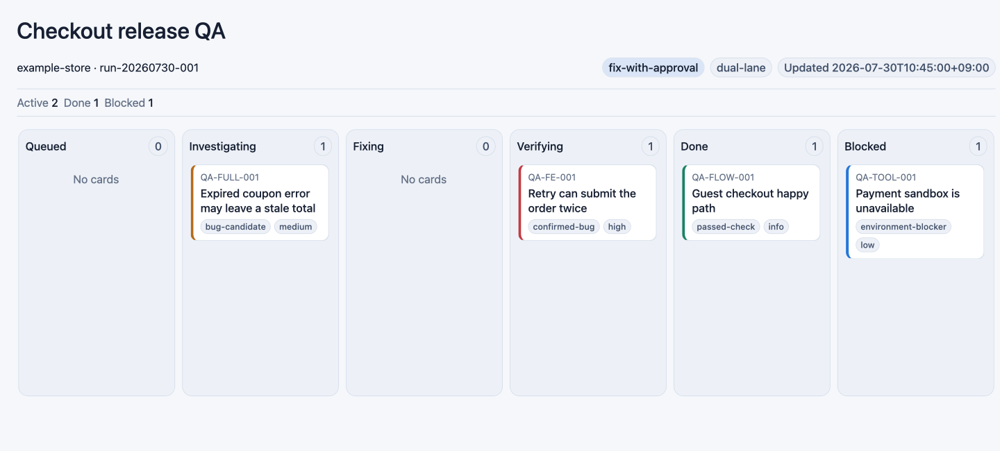
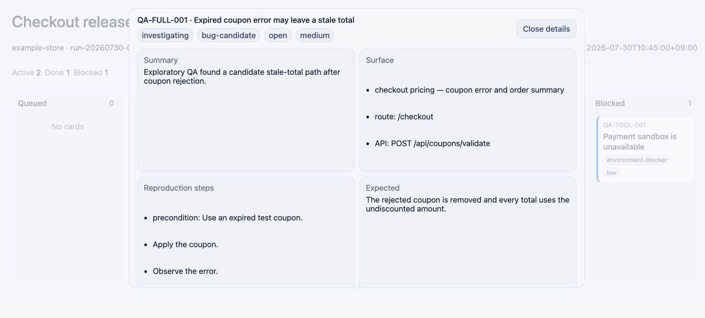

# Agent QA Kanban

Agent QA Kanban is an open Agent Skill that combines three workflows:

1. evidence-led regression and exploratory QA
2. a live kanban view of every QA card
3. append-only learning from explicit human QA feedback

The board JSON is the source of truth. Host-specific renderers turn the same
board into a Codex inline visualization, a standalone/Claude HTML artifact, or
a Markdown fallback.

## Preview

### Compact six-column board



The overview keeps all six statuses in one horizontal row. Each column scrolls
vertically while the board wrapper owns horizontal scrolling.

### Card detail dialog



Selecting a compact card opens its full evidence, diagnosis, and next action in
a read-only dialog instead of extending the board page.

_Both previews are rendered from `examples/qa-board.example.json` at the same
viewport and contain synthetic data only._

## Why this exists

QA execution skills, kanban task managers, and interactive artifact builders
usually exist as separate tools. This skill joins them without making the UI
the system of record:

- every finding has a stable card ID, status, classification, evidence, and
  next action
- cards move through `queued`, `investigating`, `fixing`, `verifying`, `done`,
  or `blocked`
- a card cannot be marked done without verification evidence
- human feedback is learned separately from agent-discovered findings
- human learning is appended only when repository policy or the user authorizes it
- unsupported hosts still receive a complete Markdown board

## Install

Install directly from GitHub with an Agent Skills-compatible installer:

```bash
npx skills add jadeonstudio/agent-qa-kanban --skill agent-qa-kanban
```

Or copy `skills/agent-qa-kanban` into the skill directory used by your agent.

## Use

Example requests:

```text
Use $agent-qa-kanban to QA the checkout flow and keep the findings in an inline kanban.
```

```text
Use $agent-qa-kanban in audit-only dual-lane mode. Read our human QA log first,
then expand into adjacent routes and APIs.
```

```text
Continue QA-004, fix it, rerun the same scenario, and move the card only when
the evidence proves it.
```

## Board utilities

The utilities are dependency-free Node.js scripts.

```bash
node skills/agent-qa-kanban/scripts/validate-board.mjs \
  examples/qa-board.example.json

node skills/agent-qa-kanban/scripts/render-board.mjs \
  examples/qa-board.example.json \
  .tmp/qa-board-fragment.html \
  --mode fragment

node skills/agent-qa-kanban/scripts/render-board.mjs \
  examples/qa-board.example.json \
  .tmp/qa-board.html \
  --mode standalone

node skills/agent-qa-kanban/scripts/render-markdown.mjs \
  examples/qa-board.example.json \
  .tmp/qa-board.md
```

Record a validated human-feedback entry:

```bash
node skills/agent-qa-kanban/scripts/validate-human-learning.mjs \
  examples/human-feedback.example.json

node skills/agent-qa-kanban/scripts/record-human-learning.mjs \
  .qa-kanban/human-qa-learning.jsonl \
  examples/human-feedback.example.json
```

The recorder rejects agent-only observations, duplicate IDs, dangerous object
keys, and entries that are not explicitly marked as redacted.

## Development

```bash
npm test
npm run validate:example
npm run validate:human-example
npm run render:example
```

No product server, browser, database, or external service is started by these
commands.

## Portability

The Agent Skills workflow is portable, but inline UI bridges are host-specific.

| Host capability | Output |
| --- | --- |
| Codex inline visualization | HTML fragment plus host inline directive |
| HTML/Artifact-capable agent | standalone CSP-protected HTML |
| File preview only | standalone HTML |
| No HTML surface | Markdown board |

Interactive controls are only rendered when a working host callback exists.
The board deliberately does not provide drag-and-drop because a visual move
that does not update the canonical JSON would be misleading.

## License

MIT
